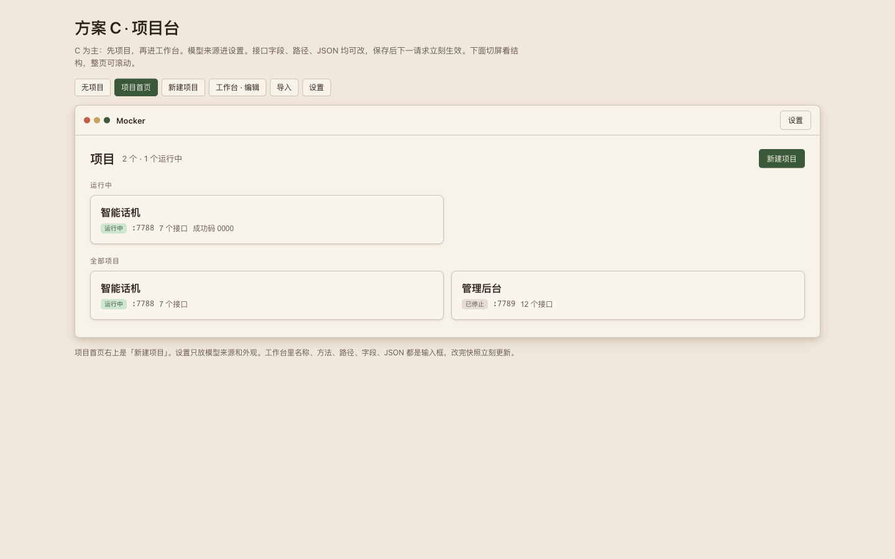
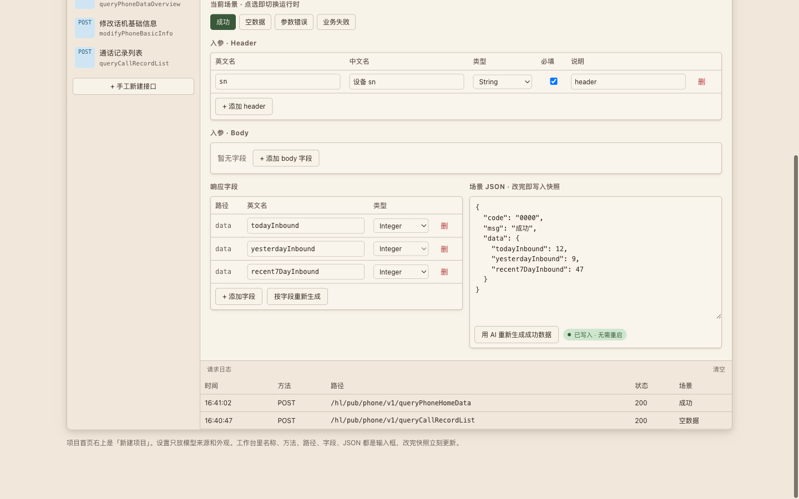
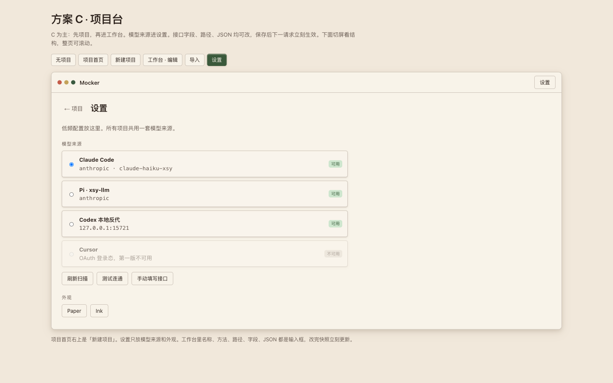

# Mocker

<p align="center">
  
</p>

<p align="center">
  <strong>从设计文档到可请求的接口，只隔一个本地端口。</strong>
</p>

<p align="center">
  面向前端联调的 macOS 桌面 Mock 工具<br />
  粘贴接口说明 → AI 生成场景数据 → 本机一键起服务
</p>

<p align="center">
  
  
  
  
</p>

---

后端还没好、接口文档已经写了？把说明扔进 Mocker，把前端 `baseURL` 指到 `http://127.0.0.1:<端口>`，页面就能跑起来。

| 痛点 | Mocker 怎么做 |
|------|----------------|
| 手写 mock JSON 又慢又不像真数据 | 用本机已有 AI 配置生成语义化成功数据 |
| 改个字段还要重启服务 | 改场景 / JSON / 路径后下一请求立刻生效 |
| 成功、空列表、参数错、业务失败来回切 | 四个场景一键切换，无需重启 |
| 多项目抢端口 | 每个项目独立端口，可同时运行 |

<p align="center">
  
</p>

<p align="center">
  <sub>项目台 · Paper 主题</sub>
</p>

## 功能一览

- **项目台** — 多项目、多端口；启停状态一目了然
- **AI 导入** — 粘贴接口说明或导入文档，预览勾选后写入
- **四场景** — 成功 / 空数据 / 参数错误 / 业务失败，点选即切
- **字段与 JSON** — 入参、响应字段树可编辑；支持「用 AI 重新生成成功数据」
- **热更新** — 改完写入快照，**无需重启**本地服务
- **请求日志** — 命中、未命中、缺默认头都能看见
- **模型来源** — 扫描 Claude Code / Pi / Codex / Grok，或手动填写；厂商多模型可下拉切换
- **外观** — Paper（卡纸）与 Ink（墨色）两套主题

<p align="center">
  
</p>

<p align="center">
  <sub>工作台 · 场景切换 · 字段与 JSON · 请求日志</sub>
</p>

## 快速开始

### 环境

- macOS
- [Rust](https://rustup.rs/)（edition 2021）
- 本机已配置可用的 LLM（Claude Code / Pi / Codex / Grok，或设置里手动填写）

### 构建并运行

```bash
cargo build
# 或开发时直接跑
cargo run
```

打包为 `.app`（示例流程）：

```bash
export CARGO_TARGET_DIR="$PWD/target"
cargo build
mkdir -p dist/Mocker.app/Contents/MacOS
cp -f target/debug/mocker dist/Mocker.app/Contents/MacOS/Mocker
# 按需拷贝 Info.plist / 图标后签名
codesign --force --sign - --timestamp=none dist/Mocker.app
open dist/Mocker.app
```

> `dist/` 不入库，本地打包产物请自行生成。

### 日常路径

1. 打开 **设置**，选择模型来源（可刷新扫描本机配置）
2. **新建项目**：端口、成功码 / 失败码、默认头（如 `sn`）
3. **导入** 或手工新建接口 → 预览确认
4. **启动** 项目
5. 前端把 baseURL 设为 `http://127.0.0.1:<端口>`
6. 在工作台切换场景、改 JSON，下一发请求立刻变

```bash
curl -s http://127.0.0.1:7788/your/api/path \
  -H 'Content-Type: application/json' \
  -d '{}'
```

<p align="center">
  
</p>

<p align="center">
  <sub>设置 · 模型来源扫描 · Paper / Ink</sub>
</p>

## 模型来源

所有项目共用一套全局模型配置。扫描会读取本机常见工具配置（**密钥不写入 SQLite**，请求时现场读取）：

| 工具 | 配置路径 |
|------|----------|
| Claude Code | `~/.claude/settings.json` |
| Pi | `~/.pi/agent/models.json` |
| Codex | `~/.codex/config.toml` |
| Grok | `~/.grok/config.toml` |

也支持在设置里 **手动填写** OpenAI Chat / Anthropic Messages 兼容接口。同一厂商多个模型时，可在来源卡片上用下拉切换并记住选择。

## 技术架构

单进程桌面应用：GPUI 画界面，Tokio + Axum 在进程内提供 `127.0.0.1` Mock HTTP。

```
粘贴 / 文档 ──► LLM ──► 接口草稿 + 成功 JSON
                      │
                      ▼
              程序生成空 / 错误场景
                      │
                      ▼
              预览确认 ──► SQLite
                      │
                      ▼
              启动项目 ──► 路由快照 ──► 127.0.0.1:端口
                      │
              改场景 / JSON ──► 热替换快照（无需重启）
```

| 层 | 职责 |
|----|------|
| UI | 项目台、导入、工作台、设置（GPUI + gpui-component） |
| 应用服务 | 导入提交、启停、切场景、选模型 |
| 来源扫描 | 读本机 AI 配置，列出可用源 |
| 运行时 | Axum 精确匹配 method+path，写请求日志 |
| 存储 | SQLite（`~/Library/Application Support/Mocker/`） |

数据落盘后重启应用仍在；**运行状态不持久化**，重新打开后需手动启动服务。

## 开发

```bash
# 单元 / 集成测试
cargo test

# 离线构建（CI / 无网）
cargo build --offline
cargo test --offline
```

主要目录：

```
src/
  ui/        # 首页、新建、导入、工作台、设置
  sources.rs # 模型来源扫描
  llm.rs     # 协议调用与模型列表
  runtime.rs # 本地 Mock HTTP
  store.rs   # SQLite
tests/       # 验收与模块测试
docs/        # 设计与说明
```

## 路线图外（当前不做）

有状态 CRUD、真鉴权、延迟/断网模拟、OpenAPI 一键导入、团队共享服务、客户端内试发请求等，不在当前主路径里。欢迎 Issue / PR 讨论优先级。

## License

[MIT](LICENSE) © 2026 hanxiaofeng1860
